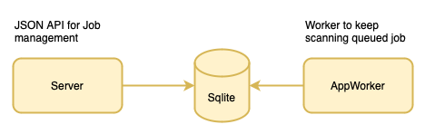

# Credscan
minimal repository scanner service


## Stack on this app
- Sqlite3
- Golang

## How Worker works
- find queued job if exist
- Clone repository to working dir
- iterate through the files
- write the result back to database



## Todo
- [ ] single entity get API
- [ ] Containerized
- [ ] handling repository scan error
- [ ] recover failed/crash job
- [ ] Optimize worker pool
- [ ] Ability to remove Job
- [ ] better to have docker compose for quick start

## How to use it
you need to run both server and worker and mount the same working dir
```
$ docker run -v $(pwd)/data:/app/data -p 3000:3000 credscan/server 
$ docker run -v $(pwd)/data:/app/data -p 3000:3000 credscan/worker
```
then you can try to post some job via server

```
$ curl -X "POST" "http://localhost:3000/job" \
     -H 'Content-Type: application/x-www-form-urlencoded; charset=utf-8' \
     --data-urlencode "repositoryUrl=https://github.com/guardrailsio/backend-engineer-challenge" \
     --data-urlencode "repositoryName=Test Repo"
```

and you can query all of the result from this API


```
$ curl "http://localhost:3000/jobs"
```